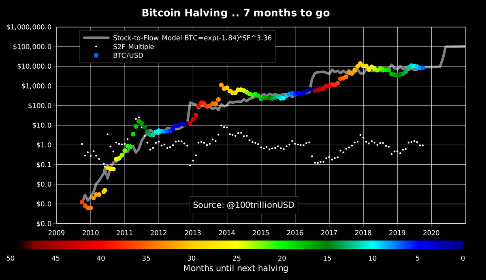

# FinTech
## FinTech projects

 ### Who are you? What is your background?

    I work in IT, Computer Analist I attend Devry and have a degree in network communications.  I also have a Network+ certificate.  I have experience in support pharmacy automation and robitics.  Currently I am supporting a Health system.
​
### What are your career goals?

    Combine my current skills with my future FinTech skills and obtain a new position in the realm of Fintech.  This could be somewhere in the healthcare sector, with my current company or a new company.
​

### Why did you choose FinTech as a career path?

    The future is bright and I am a Hodler and Blockchain enthusiast.  To challange myself.

    [code](/code/)
    [data](/data/)
    [images](/image/)
    [references](/references/)